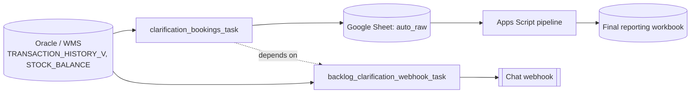

# Architecture

Two Databricks tasks run as one job: `clarification_bookings_task` (the main
extract-and-load) must succeed before `backlog_clarification_webhook_task` (the
backlog notification) runs, but the webhook task's own failure does not roll back
or block the sheet refresh — they have independent retry policies (see
[failure-and-recovery.md](failure-and-recovery.md)).

The Apps Script pipeline is a separate, independently triggered system (daily
time-based trigger, or manually from a Sheets custom menu). It is not called by the
Databricks job — it reads the `auto_raw` tab the Databricks job wrote to, on its
own schedule.

## Components

| Component | Runtime | Responsibility |
|---|---|---|
| `src/clarification_bookings.py` | Databricks (Python) | Extract clarification bookings, idempotent write to `auto_raw` |
| `src/backlog_clarification_webhook.py` | Databricks (Python) | Sum current backlog, post to chat |
| `sql/clarification_booking.sql`, `sql/backlog_clarification.sql` | Oracle | Parameterized extract queries |
| `src/apps_script/00_Config.js` … `07_Triggers.js` | Google Apps Script | Reconcile manual + automated data into the final workbook |
| `shared/logistics_data_utils` | Python package | Connection setup, config loading, idempotent sheet writes, notifications (shared across featured projects) |
