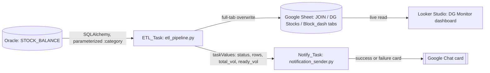

# Dangerous Goods Data Product

A source-of-truth pipeline for the dangerous-goods (DG) compliance dashboard at a
large European e-commerce fulfillment site: an Oracle stock query, a Pandas clean,
and a Google Sheets write replace a manual multi-megabyte export that operators
used to paste into a spreadsheet by hand every shift. The Sheet, in turn, backs a
Looker Studio dashboard the outlet and compliance teams use to keep hazardous
storage volumes under their legal thresholds.

This project folds together two source projects: the extract/load pipeline itself
(all the code here comes from it) and a second, code-less project that documented
the downstream dashboard and compliance-monitoring narrative. See
[docs/decisions.md](docs/decisions.md) for why they were merged into one featured
case study.

## 1. Business Problem

Dangerous-goods stock volumes are legally capped per storage location and hazard
class. Before this pipeline existed, keeping the compliance dashboard current
meant an operator exporting a large report (~70 MB+) from a legacy
warehouse-management terminal every shift and pasting it into a Google Sheet by
hand — slow, error-prone, and periodically broken outright by browser/Apps Script
import limits on files that size.

## 2. Users and Decisions Supported

- **Outlet and compliance teams** use the resulting dashboard to see which
  hazard-class volumes are approaching their storage limits and need
  prioritized removal, without waiting on a manual export.
- **On-call / the operating team** get a same-run chat notification with row
  counts and volume totals on success, or a failure alert with a manual-fallback
  link when the automated run doesn't complete.

## 3. Measured Impact

- The operating team's own reporting put the eliminated manual export-and-paste
  routine at **roughly 100 minutes of manual work removed per day** (this
  pipeline runs twice on weekdays). This is a **reported, historical estimate
  from the operating team, not a figure independently re-derived or re-measured
  in this repository** — see [docs/validation.md](docs/validation.md).
- Replaced a manual copy/paste step that was periodically broken by file-size
  limits with a parameterized query that only pulls the rows a given category
  needs.
- Gives the dashboard a same-shift success/failure signal instead of silence
  when an update didn't happen.

## 4. Architecture

Two Databricks tasks run as one job. `ETL_Task` extracts, cleans, and writes stock
data to the Sheet, then reads the Sheet's own formula tab back to compute total and
"ready for removal" volume. `Notify_Task` depends on it and reads
`status`/`rows`/`total_vol`/`ready_vol` from `dbutils.jobs.taskValues` to build a
Google Chat card. The Looker Studio dashboard reads directly and continuously from
the same Sheet — it is not called by either task; it just reflects whatever the
Sheet currently holds.

## 5. Data Flow and Grain

1. `sql/stock_balance_query.sql` selects dangerous-goods stock rows for a bound
   `:category` parameter (e.g. `Beauty`) from a generic Oracle view alias
   (`STOCK_BALANCE` — see [docs/data-contract.md](docs/data-contract.md)),
   excluding two internal carrier/description prefixes that mark
   non-sellable/transit handling units.
2. `src/etl_pipeline.py` cleans the extract (`clean_stock_dataframe`): keeps only
   rows whose handling-unit reference starts with a digit, then trims to the
   first 22 columns the Sheet's formulas expect.
3. The cleaned data **fully overwrites** the Sheet's `JOIN` upload tab on every
   run (`batch_clear` then `update`) — this is current-state stock, not a
   historical log, so there is no per-date append like
   [featured/01](../01-clarification-automation)'s write. A `Block_dash` tab gets
   a single stamped run timestamp.
4. After a fixed 5-second wait for the Sheet's own formulas to recompute,
   `etl_pipeline.py` reads the `DG Stocks` calc tab back and recomputes total and
   "ready for removal" volume (`compute_volumes`) from specific column positions
   in that formula tab (see [docs/data-contract.md](docs/data-contract.md) for
   exactly which ones and why they're positional, not named).
5. `src/notification_sender.py` reads the handoff values via
   `dbutils.jobs.taskValues` and posts a Google Chat card: a metrics summary and
   dashboard link on success, or a failure reason and manual-fallback link on
   failure.
6. **What this pipeline does not do:** it does not classify anything by UN number
   or hazard class, and it does not compute a "days to threshold" forecast. Those
   are described in the source dashboard project's narrative but do not appear
   anywhere in this pipeline's committed Python — see
   [docs/decisions.md](docs/decisions.md) for why the README doesn't claim them
   as part of this codebase.

## 6. Engineering Decisions

- **Full-tab overwrite, not idempotent per-date append.** Unlike
  [featured/01](../01-clarification-automation), which appends and de-duplicates
  by date because it's writing a historical log, this pipeline's Sheet represents
  *current* stock. Clearing and rewriting the whole tab every run is simpler and
  correct for that shape of data — there's no "which date's rows" question to
  answer.
- **Query pushdown via a bound parameter, not a full-table pull.** `:category` is
  passed to Oracle as a bind parameter through SQLAlchemy's `text()`, so only the
  rows for the category being run come over the wire, not the entire source table.
- **A narrow secret fetch for the notifier task, not the full connection set.**
  `notification_sender.py` fetches only `chat_webhook_url` from the secret scope
  (`get_webhook_url`) instead of calling the same `logistics_data_utils.get_connections`
  helper `etl_pipeline.py` uses — the notify task never touches Oracle or Sheets,
  so it doesn't request credentials for them.
- **Widget/config resolution moved into `main()`, not run at import time.** The
  original notebook read `dbutils.widgets` at module scope, which made the file
  unimportable outside a live Databricks context. Both entry points here resolve
  `dbutils` (via `resolve_dbutils()`) and read widgets from inside `main()`
  instead, so the pure transformation and payload-building functions can be
  imported and unit-tested without a Databricks runtime.
- **`logistics_data_utils` reused where it's genuinely the same operation, kept
  local where it isn't.** Config loading, connection setup (for `ETL_Task`), and
  logging setup reuse the shared package (see
  [shared/logistics_data_utils](../../shared/logistics_data_utils)). The Sheet
  write, the volume-mask calculation, and the Chat card layout stay local to this
  project because they're materially different from the shared package's generic
  idempotent-write and generic pass/fail card — forcing them into the shared
  shape would have meant either changing this pipeline's actual behavior or
  misrepresenting what the shared functions do.
- **`config/config.example.json` stays JSON, not YAML**, for the same reason
  documented in featured/01's decisions: the runtime code loads it with
  `logistics_data_utils.load_config` (backed by `json.load`), and converting the
  shipped example without rewriting the loader would misrepresent what the code
  does. To run either script, copy it into place first:
  `cp config/config.example.json src/config.json`, then fill in a real
  `sheet_id` and the dashboard/fallback links.

## 7. Validation Evidence

| Control | Purpose | Method | Status | Evidence |
|---|---|---|---|---|
| Query pushdown / parameterized extraction | Avoid full-table scans and SQL injection | Bound `:category` parameter via SQLAlchemy `text()` | **Implemented** | `sql/stock_balance_query.sql`; `u.run_sql_file(engine, sql_path, params={"category": category})` in `etl_pipeline.py` |
| Stock-row cleaning filter | Keep only rows with a numeric handling-unit reference | Regex filter (`^\d`) + fixed 22-column trim | **Implemented** | `clean_stock_dataframe()`; unit-tested with a synthetic fixture — `tests/unit/test_stock_cleaning.py` |
| Ready-volume threshold masking | Isolate outlet-ready dangerous-goods volume for prioritization | Boolean mask chain over calc-tab columns (location type, category, numeric prefix) | **Implemented** | `compute_volumes()`; unit-tested — `tests/unit/test_volume_calculation.py` |
| UN-number / hazard-class classification | Regulatory classification of each SKU | — | **Unknown — not present in this codebase** | Described in the source dashboard project's narrative but does not appear anywhere in the committed Python; see [docs/decisions.md](docs/decisions.md) |
| "Days difference" threshold forecast | Flag items approaching a storage-time limit | — | **Unknown — not present in this codebase** | Same as above — if it exists at all, it lives in Sheet formulas or the Looker Studio layer, outside this repository |
| Success/failure chat notification (payload) | Alert with run metrics or a failure reason | Chat card built from `dbutils.jobs.taskValues` handoff | **Implemented** | `build_card()` / `send_card()` in `notification_sender.py`; unit-tested — `tests/unit/test_notification_card.py` |
| Failure-path notification delivery | A failed `ETL_Task` run actually reaches chat | Job-level task dependency condition | **Planned** (fixed in the public template, not verified against the original job) | The original `databricks.yml` never set `run_if` on `Notify_Task`'s dependency, which defaults to `ALL_SUCCESS` in Databricks Jobs — so `Notify_Task` (the only task with failure-card logic) may never have run when `ETL_Task` failed. `config/databricks.bundle.example.yml` sets `run_if: ALL_DONE` explicitly with a comment explaining why; see [docs/failure-and-recovery.md](docs/failure-and-recovery.md) |
| Row-count reconciliation | Confirm rows extracted from Oracle match rows landed in the Sheet | — | **Unknown** | No logging or test compares extracted vs. written row counts in the source project |
| Secret-scope parameterization | No hardcoded secret scope or workspace host ships in code | Scope resolved from a `SECRET_SCOPE` environment variable, no shipped default | **Implemented** | `get_secret_scope()` in both entry points; unit-tested — `tests/unit/test_secret_scope.py` |
| Sheet-formula sync wait | Calc tab reflects freshly uploaded data before being read back | Fixed `time.sleep(5)` | **Planned** (fragile fixed wait, not a poll/ack) | `time.sleep(5)` in `etl_pipeline.py`; see [docs/limitations.md](docs/limitations.md) |

Synthetic-fixture unit tests were added in this refactor for the parts that don't
require live Oracle/Sheets/Chat access — see [tests/](tests/) and
[docs/validation.md](docs/validation.md) for exactly what they do and don't cover.

## 8. Failure and Recovery

See [docs/failure-and-recovery.md](docs/failure-and-recovery.md) for the full
runbook, including the task-dependency gap found and fixed in the public bundle
template (above). Summary: `ETL_Task` catches any exception, records
`status=FAILURE` and the error message via `taskValues`, then re-raises so the
Databricks UI marks the task failed. `Notify_Task` is not retried at the job level
(`max_retries: 0`) — a duplicate or stale notification is a worse outcome than a
missed one.

## 9. Trade-offs

- The full-tab overwrite is simple and correct for current-state data, but it
  means a mid-run failure between `batch_clear` and `update` would leave the
  upload tab empty until the next successful run — there is no staging/swap step.
- The 5-second fixed sleep between writing raw data and reading back
  formula-derived columns is a pragmatic choice over building a poll-until-ready
  check against the Sheets API, at the cost of being a real (if narrow) race
  condition under slow Sheet recalculation.
- Classification and forecasting logic living in spreadsheet formulas/dashboard
  layer rather than in Python trades testability and version control for the
  ability of non-engineers on the compliance team to adjust thresholds without a
  code deploy.

## 10. Sanitization Notes

This project's original identifiers were redacted per
[docs/sanitization-policy.md](../../docs/sanitization-policy.md): the workspace
hostname, secret-scope name, the job/bundle name, the Chat card's header title,
the source table name, and the legacy export terminal's vendor name were all
replaced with placeholders or generic labels (`STOCK_BALANCE`, `DG_Stock_Monitor`,
`dangerous_goods_data_product`, and so on); none of them change the shape of the
query or transformation logic. No screenshot of the dashboard is included in this
repository (see [docs/decisions.md](docs/decisions.md)); the dashboard is
described in prose and the diagram above instead.

## 11. What I Would Improve Next

- Add a real row-count reconciliation check (rows extracted vs. rows landed in the
  Sheet) instead of trusting the full-overwrite write implicitly.
- Replace the fixed 5-second sleep with a poll/ack against the Sheet (e.g. re-read
  a checksum cell) before reading the calc tab back.
- Verify the `run_if: ALL_DONE` fix against a real Databricks workspace — it's
  applied in the public bundle template based on documented Databricks Jobs
  default behavior, but wasn't verified against the original production job
  before this repository was written.
- If UN-number/hazard-class classification is ever meant to be a guarantee this
  pipeline provides (rather than a spreadsheet formula someone could silently
  break), move it into tested Python rather than leaving it entirely to the Sheet.
