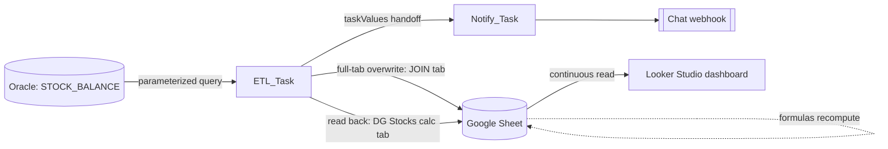

# Architecture

`ETL_Task` and `Notify_Task` run as one Databricks job (`ETL_Task` must succeed —
see the note on `run_if` in [failure-and-recovery.md](failure-and-recovery.md) for
why "must succeed" was the original, likely unintended, condition). The dashboard
is not called by either task; it reads continuously and independently from the
same Sheet, so its freshness is entirely a function of when the job last ran
successfully.

## Components

| Component | Runtime | Responsibility |
|---|---|---|
| `src/etl_pipeline.py` | Databricks notebook (Python) | Extract stock rows for a category, clean, overwrite the Sheet, read back calc-tab volumes |
| `src/notification_sender.py` | Databricks notebook (Python) | Build and post a Google Chat card from the handoff task values |
| `sql/stock_balance_query.sql` | Oracle | Parameterized stock extract |
| `config/config.example.json` | — | Sheet IDs, tab names, dashboard/fallback links (copy to `src/config.json` locally, gitignored) |
| `shared/logistics_data_utils` | Python package | Config loading, connection setup, logging setup (shared across featured projects; sheet-write and card-building logic here are project-specific, not shared) |

## Why the dashboard isn't part of this repository's code

The Looker Studio "DG Monitor" dashboard and the Sheet formulas that back its
`DG Stocks` calc tab are configured entirely outside this pipeline's Python — in
the Sheet itself and in the Looker Studio report editor. Nothing in
`src/etl_pipeline.py` or `src/notification_sender.py` writes formulas, defines a
UN-number/hazard-class mapping, or computes a "days to threshold" forecast. This
repository documents what the dashboard and Sheet are understood to do (from the
original dashboard project's narrative) without claiming that logic as part of
this pipeline's tested code — see [decisions.md](decisions.md).
