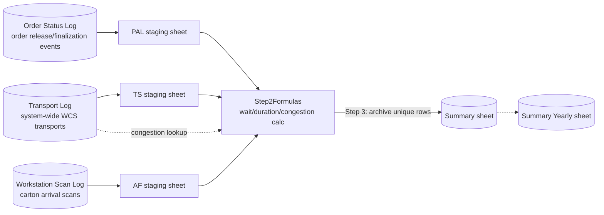

# Order Flow Bottleneck Analysis

A one-click Google Apps Script analysis that quantified why palletization
workstations were stalling during order fulfilment. The operational
hypothesis was that background automated-storage (AKL) transport traffic was
delaying urgent order cartons behind routine stock movements; this tool
joined three independent event logs to produce the data needed to test that
hypothesis.

**This is a correlational analysis, not a controlled experiment.** It found
a positive association between background transport volume and order
duration — it did not, and could not on its own, prove that the transport
volume *caused* the delay. See [Measured Impact](#3-measured-impact) and
[Trade-offs](#9-trade-offs) below for exactly what the data does and doesn't
support.

## 1. Business Problem

Order-carton throughput at the palletization workstations was inconsistent,
and the team suspected the automated storage and retrieval system (AKL) —
which also moves large volumes of routine, non-order stock in the
background — was treating urgent order cartons no differently from routine
moves. There was no existing report that put order timing and background
transport volume side by side, so the suspicion couldn't be tested with the
data already on hand.

## 2. Users and Decisions Supported

- **Warehouse control system (WCS) / automation engineers** used the
  wait-time and congestion output to decide whether a prioritization change
  for order-carton retrieval was worth making.
- **Shift/operations leads** used the per-order wait and processing-duration
  breakdown to see whether stalls clustered around specific times of day or
  shifts (the analysis buckets orders into a morning/afternoon shift flag
  for exactly this purpose).

## 3. Measured Impact

- The analysis found a **positive correlation between concurrent
  non-order transport volume and total order duration** — orders with more
  background transport activity in their active window tended to take
  longer, consistent with the deprioritization hypothesis.
- That finding was evidence used to support a change to the WCS's transport
  prioritization logic, favoring order-carton retrieval over routine stock
  movement. **This tool did not implement, deploy, or measure the outcome of
  that change** — it produced the supporting evidence for the decision, not
  the fix itself.
- **Correlation is not causation, and this analysis does not close that
  gap.** It does not control for confounders that could independently drive
  both metrics up together — for example, a busy shift naturally has both
  more total transports of every kind *and* more orders queuing for the same
  workstations. No randomization, no A/B split, and no formal statistical
  test (e.g. regression with confounder controls) was applied here; the
  finding is a plotted/tabulated association over a bounded date range, read
  by a human, not a statistically validated causal estimate. Treat the
  "supported a WCS prioritization change" outcome as a decision informed by
  suggestive evidence, not as a proven causal result.

## 4. Architecture

A single bound Apps Script, triggered from a spreadsheet menu (`Extract >
Step 1-4`) or run step-by-step, executes four functions in sequence:

1. **`runStep1_PrepareData`** — pulls rows from the three source logs into
   staging sheets (`TS`, `PAL`, `AF`) via spreadsheet `QUERY()` formulas.
2. **`runStep2_RunAnalysis`** — computes per-order wait time, processing
   duration, and concurrent-transport counts on the `Step2Formulas` sheet.
3. **`runStep3_ArchiveResults`** — copies newly-computed, not-yet-archived
   rows into the persistent `Summary` sheet.
4. **`runStep4_Cleanup`** — clears the staging and source sheets so the next
   run starts clean.

## 5. Data Flow and Grain

1. **Order Status Log** (`SHEETS.ORDER_STATUS_LOG`) — order finalization
   events; `runStep1_PrepareData` extracts rows where an order enters the
   "finalization started" status for the outlet order type, feeding the
   `PAL` staging sheet with carton count per order.
2. **Workstation Scan Log** (`SHEETS.WORKSTATION_SCAN_LOG`) — carton arrival
   scans at palletization workstations; extracted into the `AF` staging
   sheet, joined back to `PAL` (carton count) and `TS` (transport
   timestamps) via `XLOOKUP`.
3. **Transport Log** (`SHEETS.TRANSPORT_LOG`) — every automated transport
   movement WCS-wide; extracted twice into `TS` (order-carton transport
   completion/creation timestamps, filtered to an order-carton ID prefix)
   and referenced again in Step 2 for the concurrent-transport counts.
4. **`Step2Formulas`** computes, per unique order (grain: one row per order
   key in column C):
   - **Initial wait** (`E`/`F`/`G` columns) — first and last scan time
     bounds and their difference.
   - **Processing rate** (`I`, `J`, `L` columns) — duration relative to
     carton count, two different ways (columns `H` and `K` supply two
     different carton-count lookups).
   - **Congestion** (`S`–`AA` columns) — nine `COUNTUNIQUEIFS` formulas,
     each counting a different concurrent non-order-transport
     type/zone/direction combination within the order's active window
     (`E3`–`F3`), as a proxy for background WCS load.
   - **Shift bucket** (`R` column) — 1 for the 06:00–14:45 shift, 2
     otherwise.
5. **`Summary`** — Step 3 appends rows from `Step2Formulas` whose column-C
   key isn't already present in `Summary`, i.e. the archive step is
   deduplicated **by order key**, not by full-row content.

## 6. Engineering Decisions

- **The spreadsheet itself is the datastore**, moved through
  Source → Staging → Archive tabs on every run, rather than an external
  database or Databricks job. This was a deliberate one-off analysis tool,
  not a production pipeline — see [docs/limitations.md](docs/limitations.md)
  for what that trades away.
- **`QUERY()`/`COUNTUNIQUEIFS()` spreadsheet formulas do the heavy lifting**,
  not server-side code. This keeps the tool inspectable and editable by
  anyone who can open the sheet, at the cost of testability (see
  [Validation Evidence](#7-validation-evidence)).
- **Archive dedup is by business key (order ID in column C), not by
  full-row equality.** `runStep3_ArchiveResults` builds a set of existing
  keys from the target sheet and only appends rows whose key isn't already
  there — see [docs/data-contract.md](docs/data-contract.md) for the
  header-row edge case this creates.
- **Sheet/tab names are centralized in one `CONFIG.SHEET_NAMES` object**
  instead of being repeated as string literals throughout the script, so a
  renamed tab only needs a one-line change.
- **The archive-dedup loop was extracted into a standalone function
  (`selectNewUniqueRows`)** during this sanitization pass so it could be
  unit tested with plain Node, without needing the Apps Script
  `SpreadsheetApp` runtime — see [docs/decisions.md](docs/decisions.md).

## 7. Validation Evidence

This is a one-off analysis script, not a continuously scheduled pipeline —
several controls that would apply to a production data pipeline (idempotent
scheduled rerun, automated failure notification, SLA monitoring) genuinely
don't apply here and are marked **N/A** rather than forced into the table.

| Control | Purpose | Method | Status | Evidence |
|---|---|---|---|---|
| Join correctness across the three event sources | Order/Status/Workstation/Transport rows join on the right keys | `XLOOKUP`/`QUERY` joins keyed on order ID and carton timestamps | **Unknown** | No automated test validates the join keys against known-good sample data; correctness relies on formula review only |
| Archive dedup by business key | Re-running Step 3 doesn't duplicate already-archived orders | Set of existing column-C keys checked before appending | **Implemented** | `selectNewUniqueRows` in `src/order_transport_duration_analysis.js`, unit tested in `tests/unit/archive.test.js` |
| Archive dedup covers the header row | Header rows in staging data don't get archived as if they were order rows | — | **Known gap, not fixed** | The original script scans from row index 0, not row 1 — see `docs/data-contract.md`; `tests/unit/archive.test.js` documents this exact behavior rather than hiding it |
| Congestion formula coverage | Each concurrent-transport-type formula (columns S–AA) counts the intended zone/status combination | Manual formula review only | **Unknown** | No test harness can execute live `QUERY`/`COUNTUNIQUEIFS` spreadsheet formulas outside the Apps Script/Sheets runtime |
| Idempotent scheduled rerun | N/A | — | **N/A** | This is a manually/menu-triggered one-off analysis, not a scheduled job — see [docs/limitations.md](docs/limitations.md) |
| Failure notification | N/A | — | **N/A** | No alerting exists or was ever built for this script; a failed step surfaces only as an Apps Script execution error in the editor |
| Automated test coverage of Apps Script logic | Steps 1, 2, and 4 (`QUERY` formula construction, `SpreadsheetApp` calls) behave correctly | — | **Planned / Unknown** | Not unit-testable without the Apps Script runtime; only the Step 3 dedup helper was extractable — see [docs/validation.md](docs/validation.md) for exactly what is and isn't covered |
| Causal validity of the "background traffic delays orders" finding | The correlation reflects a real causal effect, not a shared confounder | — | **Not validated / explicitly out of scope** | See [Measured Impact](#3-measured-impact) — no confounder-control analysis or controlled experiment was performed |

## 8. Failure and Recovery

See [docs/failure-and-recovery.md](docs/failure-and-recovery.md) for detail.
Summary: this tool has no automated failure handling — if a step fails
(e.g. a source tab was renamed, or a `QUERY` formula errors), the failure
surfaces as a spreadsheet formula error or an Apps Script execution
exception in the editor, and the fix is manual: check the failing step,
correct the source data or formula, and re-run from that step (or from
Step 1, since Step 4 clears staging data and formulas are idempotent to
re-run once source data is back in place).

## 9. Trade-offs

- **Spreadsheet-native, not a scheduled pipeline.** This was built to answer
  one operational question over a bounded date range, not to run
  continuously. That kept it fast to build and easy for non-engineers to
  re-run, at the cost of automated scheduling, monitoring, and testability
  that a Databricks-style pipeline in this portfolio would have.
- **Correlational evidence, explicitly not a causal proof.** The output
  supported a WCS prioritization change, but the analysis itself doesn't
  rule out confounders (e.g. shift-level busyness driving both metrics).
  Presenting it as a data-informed hypothesis test — not a controlled
  experiment — was a deliberate framing choice carried through to this
  README, not an oversight to be "fixed" by overstating the result.
- **Header-row-inclusive archive scan, kept as-is.** The dedup loop scans
  from row 0 rather than skipping the header row deliberately mirrors the
  original script's actual behavior (see
  [docs/data-contract.md](docs/data-contract.md)) rather than silently
  "fixing" behavior during sanitization, which could misrepresent what the
  original tool actually did.
- **Nine near-duplicate `COUNTUNIQUEIFS` formulas instead of one
  parameterized function.** Apps Script formulas can't easily share logic
  the way a Python/SQL helper function could; each concurrent-transport-type
  count is a separately hand-written formula, which is more error-prone to
  maintain but was faster to build for a one-off analysis.

## 10. Sanitization Notes

This was the lowest-risk source project found in this portfolio's audit — no
company name, PII, hostnames, or secrets were present in the original
script. The sanitization here is narrower than in the other featured
projects:

- **Sheet/tab names** (`CONFIG.SHEET_NAMES`) — the original tab titles were
  internal German report names; replaced with descriptive English constants
  (`TRANSPORT_LOG`, `ORDER_STATUS_LOG`, `WORKSTATION_SCAN_LOG`,
  `SUMMARY_SHEET`, `SUMMARY_SHEET_YEARLY`).
- **WCS transport-status literals** used in `QUERY()` filters — the German
  status text (`Transportrequest erledigt` / `erstellt` / `gestartet`,
  `Finalisierung gestartet`) was replaced with a `TRANSPORT_STATUS` constants
  object; the filter logic (which status marks a transport complete vs.
  created vs. in progress) is unchanged.
- **Order-carton ID prefix** (originally a literal internal prefix filtered
  with `LIKE`) — replaced with an illustrative placeholder,
  `ORDER_CARTON_ID_PREFIX`.
- **What was intentionally left unchanged**: generic WCS zone/movement
  abbreviations used inside the Step 2 `COUNTUNIQUEIFS` formulas (`AKL`,
  `PALL`, `ZU`, `VD`, `GS`, `OL`, `Outletbehälter`, `Versandkarton`, etc.)
  are standard German-language warehouse-automation vocabulary, not unique
  identifiers for one employer or one WCS vendor — consistent with how
  generic column/domain vocabulary was handled elsewhere in this portfolio.
  See [../../docs/sanitization-policy.md](../../docs/sanitization-policy.md).

## 11. What I Would Improve Next

- Add a real join-correctness test against synthetic fixture data for all
  three source sheets, so the `XLOOKUP`/`QUERY` join keys are verified by
  something other than manual formula review.
- Fix (or at least explicitly flag on-run) the header-row-inclusive archive
  scan in Step 3, rather than carrying it forward as documented-but-unfixed
  behavior.
- Replace the nine near-duplicate `COUNTUNIQUEIFS` congestion formulas with
  a single parameterized calculation (e.g. computed in a small Apps Script
  function instead of nine hand-maintained spreadsheet formulas), reducing
  the chance that a future zone/status-code change gets applied to some
  columns and missed in others.
- If this analysis were to run repeatedly rather than as a one-off, formally
  test the causal hypothesis (e.g. a before/after comparison bracketing the
  WCS prioritization change, or a regression that controls for shift-level
  transport volume) instead of relying on a single correlational read.
