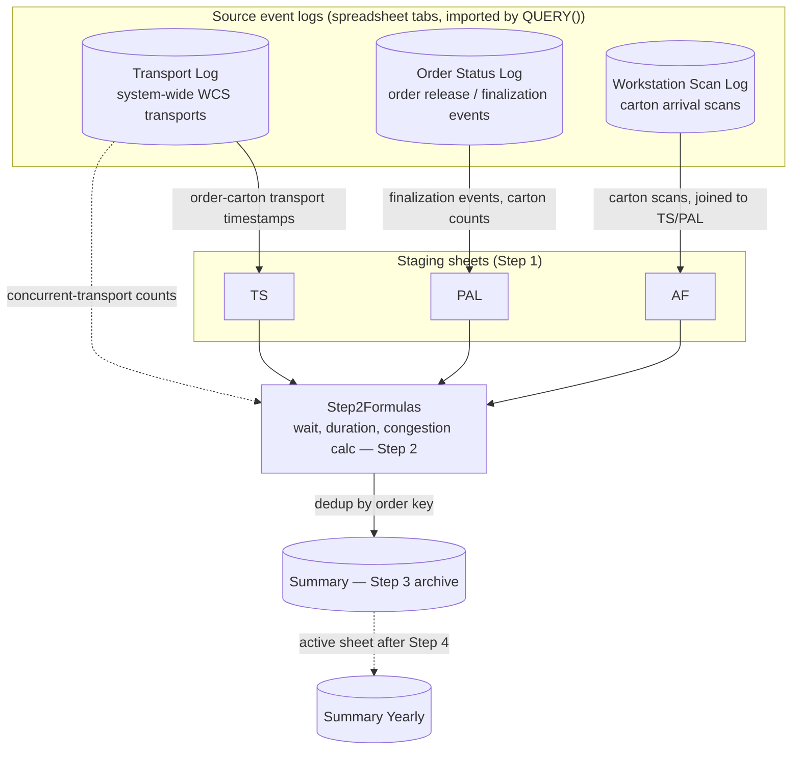

# Architecture

One bound Google Apps Script file (`src/order_transport_duration_analysis.js`)
implements all four steps as top-level functions, wired to a custom
spreadsheet menu (`onOpen`) and an orchestrator (`runAllScripts`) that runs
them in sequence with `SpreadsheetApp.flush()` between each step so formula
results are materialized before the next step reads them.

## Components

| Component | Runtime | Responsibility |
|---|---|---|
| `CONFIG.SHEET_NAMES` | Apps Script constant | Single source of truth for every tab name the script reads or writes |
| `TRANSPORT_STATUS`, `ORDER_CARTON_ID_PREFIX` | Apps Script constants | Sanitized WCS status/prefix literals used inside `QUERY()` filter strings |
| `runStep1_PrepareData` | Apps Script, `SpreadsheetApp` | Populates `TS`/`PAL`/`AF` staging sheets via `QUERY()`/`XLOOKUP` formulas |
| `runStep2_RunAnalysis` | Apps Script, `SpreadsheetApp` | Computes per-order wait time, processing duration, and 9 concurrent-transport congestion counts |
| `selectNewUniqueRows` | Plain JS (no Apps Script dependency) | Archive dedup-by-key logic, extracted so it's unit testable — see `tests/unit/archive.test.js` |
| `runStep3_ArchiveResults` | Apps Script, `SpreadsheetApp` | Reads `Step2Formulas`, calls `selectNewUniqueRows`, appends new rows to `Summary` |
| `runStep4_Cleanup` | Apps Script, `SpreadsheetApp` | Clears staging/source tabs, leaves `Summary Yearly` as the active sheet |

## Why there's no external database or job scheduler

Unlike the Databricks-based featured projects in this portfolio, this tool
was built as a bound Apps Script directly on the analysis spreadsheet, with
no Oracle/Databricks/Python component. It was a one-off investigation, run
manually from the Sheets menu over a bounded date range, not a continuously
scheduled production pipeline — see
[limitations.md](limitations.md) and the source README's original framing
for why that's an accurate (not softened) description of what this was.
