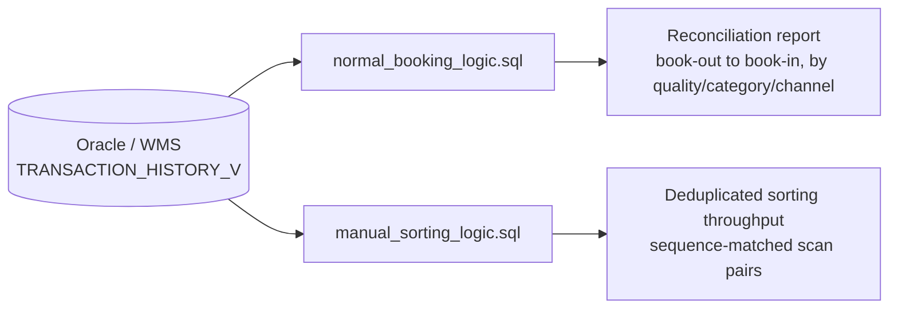

# Inventory Event Reconciliation

Two read-only Oracle SQL solutions to the same underlying problem: a warehouse
transaction-history table records every inventory movement as a flat stream of
book-out/book-in events, and neither event carries a pointer to its counterpart.
Correct stock figures — and correct sorting-productivity figures — depend on
reconstructing which book-out matches which book-in, without double-counting or
silently dropping rows. This is a **technical deep dive**: a SQL craftsmanship
showcase, not a scheduled production pipeline. There is no orchestration, job
schedule, or Python wrapper here — the artifact is the query logic itself.

## 1. Business Problem

The warehouse's Overstock department books inventory items out of a source
location and back into a destination location as two independent rows in a
shared transaction-history table (`TRANSACTION_HISTORY_V`). Two different
operational problems came from the same root cause — no explicit link between a
book-out and its matching book-in:

- **Reconciliation drift** (`normal_booking_logic.sql`): a class of transactions
  ("dummy goods" — used for stock adjustments rather than physical goods
  movement) was being silently miscounted downstream because the naive join
  between book-out and book-in rows produced duplicate or missing pairs.
- **Manual-sorting double-counting** (`manual_sorting_logic.sql`): the manual
  sorting area produced duplicate and out-of-sequence scans for the same item,
  which inflated productivity metrics when book-out rows were joined to book-in
  rows on transaction ID alone — a single `LOCAL_TRANSACTION_ID` could have
  multiple book-out/book-in pairs on the same day, and a plain join would
  cross-multiply them.

## 2. Users and Decisions Supported

- **Inventory analysts** run `normal_booking_logic.sql` to get a per-transaction
  reconciliation report (source location, destination location, quality grade,
  category, channel) used to audit whether stock levels reported elsewhere are
  trustworthy.
- **Area/shift leads** run `manual_sorting_logic.sql` to get a deduplicated,
  sequence-matched count of manual sorting scans, used to evaluate sorting
  throughput without the noise of duplicate/out-of-sequence scans inflating the
  numbers.
- Both are ad hoc analytical queries run directly by a person in a SQL client
  against a date range and optional reference-carrier filter — not scheduled
  jobs with downstream consumers.

## 3. Measured Impact

This is a query library, not a pipeline, so impact here means **data-integrity
correctness**, not time saved or volume processed:

- `normal_booking_logic.sql` fixes a specific, previously-silent failure mode:
  "dummy goods" transactions were being lost or mismatched by a naive join,
  causing reported stock figures to drift from what the WMS actually recorded.
  The `UNION ALL` split into normal-goods and dummy-goods pipelines with
  independent join logic is the direct fix.
- `manual_sorting_logic.sql` fixes a second, distinct failure mode: duplicate/
  out-of-sequence manual scans were inflating throughput counts. The
  `ROW_NUMBER()` sequence-matching join (`t1.rn = t2.rn`, see
  [docs/data-contract.md](docs/data-contract.md)) is the direct fix.
- No before/after row-count comparison from the original production environment
  exists in this repository, so no percentage-improvement figure is claimed —
  see [docs/validation.md](docs/validation.md) for exactly what is and isn't
  evidenced here.

## 4. Architecture

There is no scheduler, no write path, and no downstream system wired to these
queries in this repository — both files are parameterized `SELECT`-only
statements, run manually against a date range (and, for
`manual_sorting_logic.sql`, an optional reference-carrier filter) in a SQL
client or ad hoc through the Databricks Oracle connection used elsewhere in this
portfolio.

## 5. Data Flow and Grain

1. **Book-out capture.** Each query first isolates book-out rows
   (`MENGE < 0`, i.e. quantity leaving a location) from `TRANSACTION_HISTORY_V`,
   split by goods type (normal vs. dummy — see
   [docs/data-contract.md](docs/data-contract.md) for what distinguishes them).
2. **Book-in capture.** A parallel CTE isolates the corresponding book-in rows
   (`MENGE = 1` in `normal_booking_logic.sql`; `MENGE > 0` for the dummy-goods
   completion leg in `manual_sorting_logic.sql`).
3. **Matching.** Book-out and book-in CTEs are `LEFT JOIN`ed on
   `LOCAL_TRANSACTION_ID` — plus `rn` (a `ROW_NUMBER()`-assigned sequence index)
   for the dummy-goods leg in `manual_sorting_logic.sql`, since a single
   transaction ID can have multiple book-out/book-in pairs in that flow (see
   [docs/data-contract.md](docs/data-contract.md)).
4. **JSON custom-data extraction.** `JSON_VALUE(hv.CUST_DATA, '$.FIELD')` pulls
   quality grade, category, source channel, distribution channel, and SKU out of
   a JSON-encoded custom-data column that isn't otherwise columnized.
5. **Final grain.** Both queries emit **one row per matched book-out/book-in
   transaction pair** — not aggregated further. `normal_booking_logic.sql`
   additionally emits the classification columns (quality, category, channel);
   `manual_sorting_logic.sql` emits the same shape plus the sequence-matched EAN
   resolution described in [docs/data-contract.md](docs/data-contract.md).

## 6. Engineering Decisions

- **Two independent goods-type pipelines merged with `UNION ALL`, not one query
  with a `CASE`-driven join.** Normal goods and dummy goods have different
  matching keys, different filters, and (in `manual_sorting_logic.sql`)
  different join strategies. Keeping them as separate CTEs merged at the end
  makes each pipeline's logic auditable on its own, at the cost of some
  duplicated boilerplate between the two branches.
- **`ROW_NUMBER()` sequence matching for the dummy-goods leg in
  `manual_sorting_logic.sql`, not a plain ID join.** A plain
  `LEFT JOIN ... ON t1.LOCAL_TRANSACTION_ID = t2.LOCAL_TRANSACTION_ID` would
  cross-multiply every book-out against every book-in sharing that ID when more
  than one pair exists. Assigning `ROW_NUMBER() OVER (PARTITION BY
  LOCAL_TRANSACTION_ID ORDER BY "SEQUENCE" ASC)` on both sides and joining on
  `t1.rn = t2.rn` forces a strict 1:1 pairing in event order — see
  [docs/data-contract.md](docs/data-contract.md) for the full mechanics and
  [docs/decisions.md](docs/decisions.md) for why this was chosen over
  alternatives like `MATCH_RECOGNIZE`.
  the header comment documents exactly how to supply them from a SQL client.
- **`/*+ MATERIALIZE */` hints on every CTE in `manual_sorting_logic.sql`.**
  Oracle's optimizer can inline CTEs and re-evaluate them per reference, which
  gets expensive across a wide date range with four independently-filtered
  branches; materializing forces each CTE to be computed once and reused.
- **Bind variables (`:start_datetime`, `:end_datetime`, `:ref_lhm_filter`), not
  string-concatenated dynamic SQL.** Both queries take all filters as bind
  parameters, including a single-value/comma-list/wildcard tri-mode filter on
  the reference-carrier number (see [docs/data-contract.md](docs/data-contract.md)) —
  this avoids SQL injection risk and lets Oracle cache a single execution plan
  across runs with different filter values.
- **3-step EAN fallback in `manual_sorting_logic.sql`'s dummy-goods leg.**
  Barcode scans in the manual sorting area sometimes fail to resolve a valid
  EAN on the first read; the query falls back from the book-out row's `ARTNR`,
  to a JSON-encoded `LASTEANGOTFROMMAUS_ZIEL` field, to the book-in row's
  `ARTNR`, so a damaged/unreadable source barcode doesn't drop the row entirely.

## 7. Validation Evidence

| Control | Purpose | Method | Status | Evidence |
|---|---|---|---|---|
| Book-out/book-in matching (normal goods) | Each book-out pairs with at most one book-in per transaction ID | `LEFT JOIN` on `LOCAL_TRANSACTION_ID` in `normal_goods_t1`/`normal_goods_t2` | **Implemented** | `combined_transactions` CTE, Part 1, `normal_booking_logic.sql` |
| Duplicate prevention (manual sorting, dummy goods) | A single transaction ID with multiple book-out/book-in pairs doesn't cross-multiply | `ROW_NUMBER()` sequence assignment joined on `t1.rn = t2.rn` | **Implemented** | `dummy_goods_t1`/`dummy_goods_t2` CTEs, `manual_sorting_logic.sql` — see [docs/data-contract.md](docs/data-contract.md) |
| Orphaned book-out handling (no matching book-in) | Behavior when a book-out has no corresponding book-in yet | `LEFT JOIN` preserves the book-out row with `ZIEL_LHM` as `NULL`; final `WHERE NVL(...) <>` clause still includes it if the source/destination carrier differ | **Implemented** | Final `WHERE` clause in both files — see [docs/failure-and-recovery.md](docs/failure-and-recovery.md) for how this reads downstream |
| Same-carrier no-op filtering | A transaction whose source and destination carrier are identical (no real movement) is excluded | `NVL(ag.Source_LHM, 'value1') <> NVL(ag.ZIEL_LHM, 'value2')` | **Implemented** | Final `WHERE` clause, both files |
| Numeric-carrier filtering (manual sorting only) | Destination carrier must be a numeric carrier ID, not a placeholder/text value | `REGEXP_LIKE(ag.ZIEL_LHM, '^[0-9]+$')` | **Implemented** | Final `WHERE` clause, `manual_sorting_logic.sql` |
| Parameterized filtering (injection safety) | User-supplied date range and reference-carrier filter can't alter query structure | Oracle bind variables (`:start_datetime`, `:end_datetime`, `:ref_lhm_filter`), never string-concatenated | **Implemented** | Both files, throughout |
| Business-key uniqueness (`LOCAL_TRANSACTION_ID` matching) | The join key uniquely identifies a transaction pair (normal-goods leg) | Not explicitly — relies on `LOCAL_TRANSACTION_ID` being unique per book-out/book-in pair in the source data | **Unknown** | No test in this repository verifies this assumption against real data; if a transaction ID is reused for multiple pairs in the normal-goods flow, the plain join could cross-multiply the same way the dummy-goods flow was fixed to avoid |
| Row-count reconciliation vs. source system | Query output row count matches the true number of transaction pairs in the date range | — | **Unknown** | No logging or comparison exists; not implemented in the source project |
| Automated regression test against real Oracle data | Query results validated against a live/historical dataset | — | **Unknown** | No automated test suite existed for this SQL prior to this refactor |
| Simplified matching-logic test against synthetic data | Core book-out/book-in ID+sequence matching logic behaves correctly on known fixture data | SQLite-backed reimplementation of the core join logic, run via `pytest` | **Implemented** (for the simplified reimplementation only — see [docs/validation.md](docs/validation.md) for exactly what it does and does not prove about the production Oracle SQL) | [tests/unit/](tests/unit/), passing as of this refactor |

## 8. Failure and Recovery

This is a query library, not a running pipeline, so there's no job to retry —
"failure" here means a query returns a row that doesn't represent a real,
correctly-matched transaction. See
[docs/failure-and-recovery.md](docs/failure-and-recovery.md) for detail.
Summary:

- **Orphaned book-out (no matching book-in yet).** The `LEFT JOIN` keeps the
  row with a `NULL` destination carrier; it still passes the final `WHERE`
  filter (since `NULL <> 'value2'` evaluates true via the `NVL` fallback), so
  it surfaces in the output as a transaction still in flight rather than being
  silently dropped. There's no automatic re-check that later re-runs would
  "complete" that row once its book-in eventually lands.
- **Orphaned book-in (no matching book-out).** Because the join direction is
  book-out `LEFT JOIN` book-in, a book-in row with no book-out simply never
  appears in the output at all — it isn't surfaced as an anomaly. This is a
  known asymmetry, not a bug fix opportunity addressed here (see
  [docs/limitations.md](docs/limitations.md)).
- **Duplicate/out-of-sequence scans (manual sorting).** Handled at match time by
  the `ROW_NUMBER()` sequence join rather than after the fact — a scan that's
  out of sequence relative to its partition still gets an `rn`, so it pairs with
  whatever book-in shares that same sequence position, rather than being
  dropped or flagged.

## 9. Trade-offs

- **`UNION ALL` of two independently-filtered pipelines costs some duplicated
  SQL** in exchange for each goods-type's matching logic being independently
  readable and independently fixable (the dummy-goods sequence-matching fix in
  `manual_sorting_logic.sql` didn't require touching the normal-goods branch at
  all).
- **`ROW_NUMBER()` sequence matching assumes a meaningful, monotonic
  `"SEQUENCE"` column** to order scans within a transaction ID. If that
  column's ordering guarantee ever changes upstream, the pairing could silently
  become wrong rather than error out loudly — there's no assertion that
  verifies the ordering assumption still holds.
- **Materializing every CTE (`/*+ MATERIALIZE */`) trades memory/temp-space use
  for predictable performance** across wide date ranges — for a narrow date
  range, this hint is likely unnecessary overhead, but the query doesn't
  conditionally drop it.
- **The orphaned-book-in asymmetry (see Section 8) is a deliberate scope
  boundary, not an oversight fix included here** — surfacing "book-ins with no
  book-out" would need a second, differently-shaped query (a `RIGHT JOIN` or
  standalone anti-join), which is flagged as a possible next step in
  [Section 11](#11-what-i-would-improve-next) rather than added speculatively.

## 10. Sanitization Notes

The real production view name, the "dummy goods" partner codes, and two literal
business-classification labels appeared as hardcoded values in both source
files. Per [../../docs/sanitization-policy.md](../../docs/sanitization-policy.md):

- The real production view name → `TRANSACTION_HISTORY_V` (generic alias, not
  the real view name).
- Partner codes `TPARTNR = 520/614/207` → named illustrative constants
  (`NORMAL_GOODS_SOURCE = 1`, `DUMMY_GOODS_SOURCE_A = 2`,
  `DUMMY_GOODS_SOURCE_B = 3`), each commented as illustrative, not real
  production values.
- Two literal `DECODE` output values (source-channel labels naming the
  employer and a named partner brand) → `'Primary Channel'` and
  `'Partner Channel'` respectively, in both files.

None of these substitutions change the query's structure or logic — only the
literal identifier values and two output-label strings changed. See
[docs/decisions.md](docs/decisions.md) for why a third subfolder of
site-specific supporting queries from the original source directory was
excluded entirely rather than sanitized.

## 11. What I Would Improve Next

- Add a standalone query (or a `FULL OUTER JOIN` variant) that surfaces
  orphaned book-ins with no matching book-out — today that asymmetry (Section 8)
  is silent by construction.
- Add a row-count reconciliation check comparing query output to the raw
  book-out row count in the source date range, to catch silent join
  cardinality regressions.
- Add an assertion or data-quality check on the `"SEQUENCE"` column's ordering
  guarantee that `ROW_NUMBER()` sequence matching depends on, so a violation of
  that assumption fails loudly instead of silently mismatching pairs.
- Extend the synthetic-fixture tests in [tests/](tests/) to cover the 3-step EAN
  fallback logic and the quality/category `DECODE`/`CASE` mappings, which are
  not currently exercised.
