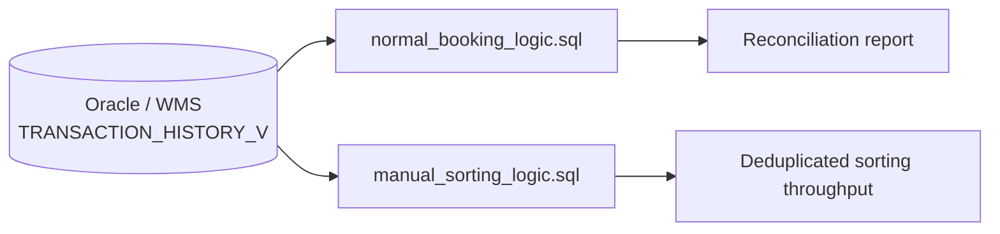

# Architecture

This is a two-query library, not a scheduled pipeline — there is no job runner,
no write path, and no downstream system wired to either query in this
repository. Both are parameterized, read-only `SELECT` statements intended to be
run directly against an Oracle connection (a SQL client, or the same Databricks
Oracle connection used by the pipeline projects elsewhere in this portfolio).

## Components

| Component | Runtime | Responsibility |
|---|---|---|
| `sql/normal_booking_logic.sql` | Oracle | Book-out/book-in reconciliation for normal and dummy goods, classified by quality/category/channel |
| `sql/manual_sorting_logic.sql` | Oracle | Sequence-matched deduplication of manual sorting-area scans, with 3-step EAN fallback |
| `tests/unit/` | Python (pytest + SQLite) | Synthetic-fixture tests of a simplified reimplementation of the core matching/dedup logic — see [validation.md](validation.md) |

## Why two files instead of one

`normal_booking_logic.sql` and `manual_sorting_logic.sql` solve structurally
similar problems (book-out/book-in matching over the same source table) but for
different consumers, with different filters, different join strategies for the
"dummy goods" leg (plain ID join vs. `ROW_NUMBER()` sequence-matched join), and
different output columns (the manual-sorting query drops the quality/category
breakdown that the reconciliation query needs, and adds the 3-step EAN
fallback that the reconciliation query doesn't need). Merging them into one
parameterized query would require a mode flag threading through nearly every
CTE, which would make each individual matching strategy harder to read in
isolation — see [decisions.md](decisions.md).

## Data source

Both queries read from a single table alias, `TRANSACTION_HISTORY_V` (the real
production view name is redacted — see
[../../../docs/sanitization-policy.md](../../../docs/sanitization-policy.md)).
There is no write path in either file; both are strictly `SELECT`-only.
